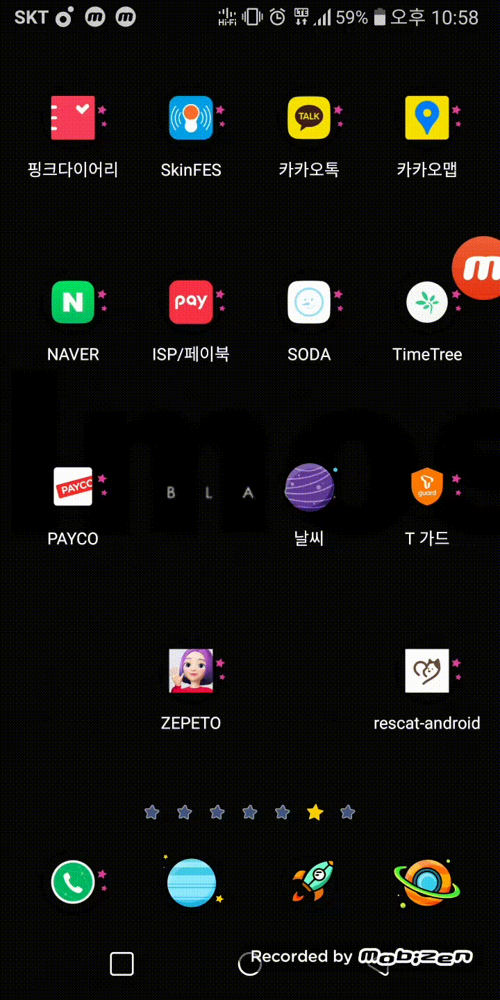
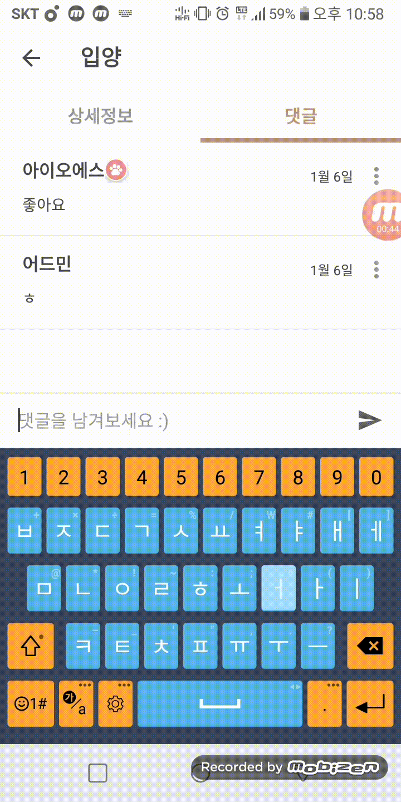
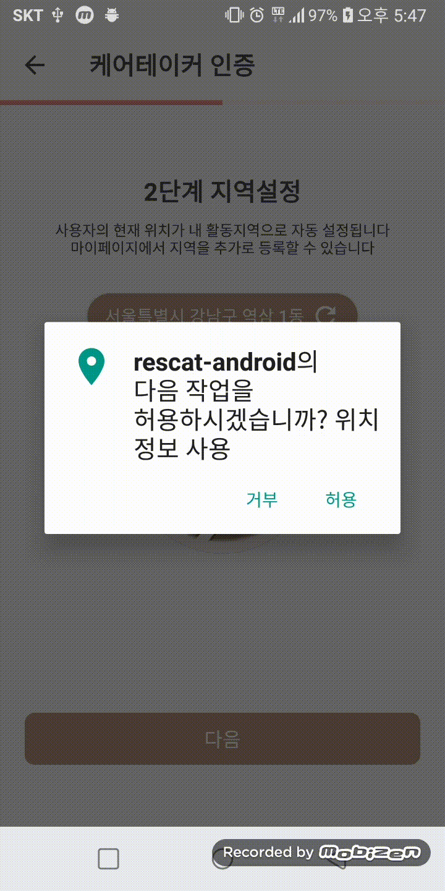

# rescat-android

### 사용 라이브러리 

```

 //google play service
    implementation 'com.google.android.gms:play-services-maps:16.0.0'
    implementation 'com.google.android.gms:play-services-location:16.0.0'

    implementation 'com.android.support:support-v4:28.0.0'
    testImplementation 'junit:junit:4.12'
    androidTestImplementation 'com.android.support.test:runner:1.0.2'
    androidTestImplementation 'com.android.support.test.espresso:espresso-core:3.0.2'

    //anko
    implementation 'org.jetbrains.anko:anko:0.10.8'
    //cardview
    implementation 'com.android.support:cardview-v7:28.0.0'
    //pageindicatorview
    implementation 'com.romandanylyk:pageindicatorview:1.0.2@aar'
    //GIF
    implementation 'com.github.bumptech.glide:glide:4.8.0'
```


### 스플래시



### 인디케이터 라이브러리


### 실시간 사진 인증


### 댓글달기



### 지도커스텀


### 현재위치 받아오기



### 인증번호 

